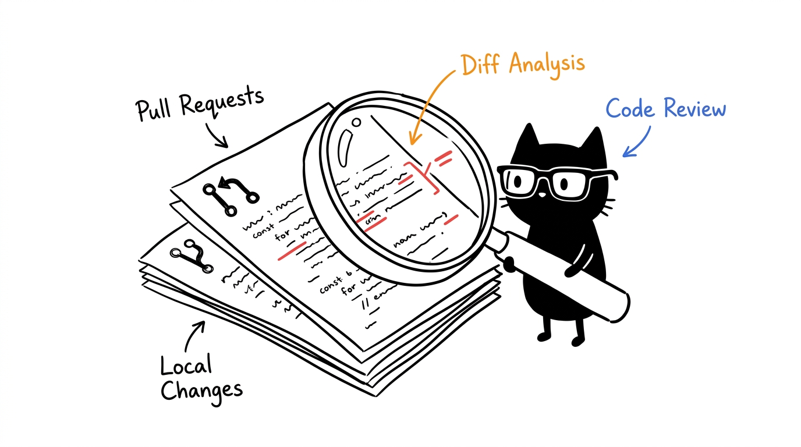
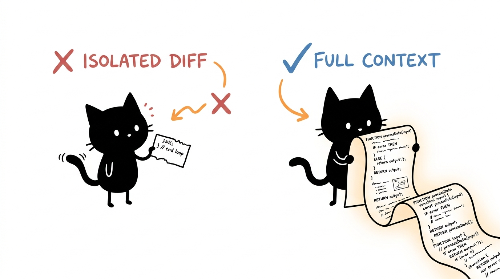
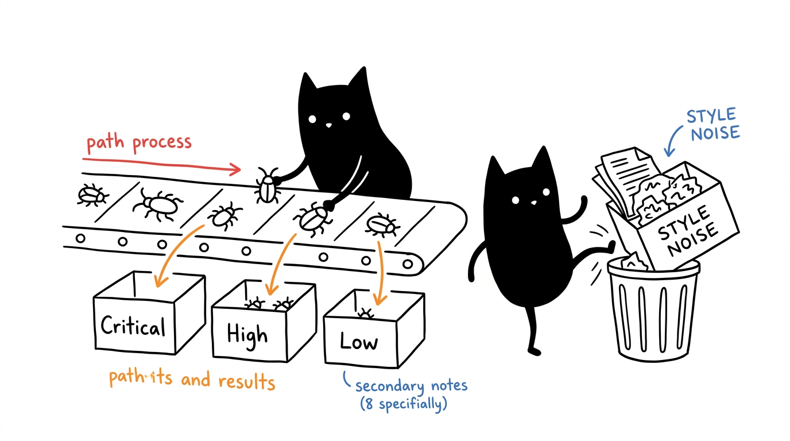

# Code Reviewer



An agent skill for reviewing local changes, commits, Git ranges, branches, and GitHub pull requests.

The skill focuses on defects that can affect users or production: incorrect behavior, security issues, regressions, data loss, unsafe failure paths, and missing tests. It avoids speculative findings and style-only noise.

## What It Does



- Reviews staged, unstaged, and relevant untracked files.
- Handles single commits, explicit Git ranges, and branch comparisons with correct diff semantics.
- Inspects GitHub pull request metadata, checks, comments, commits, and complete diffs.
- Reads affected code in context instead of judging isolated diff hunks.
- Runs the smallest relevant project-native checks when safe.
- Reports findings by severity with file references, impact, and a concrete fix direction.
- Preserves the user's index, worktree, refs, and untracked files during review.

## Installation

Clone the repository into an Agent Skills directory:

```bash
git clone https://github.com/1999AZZAR/code-reviewer.git ~/.agents/skills/code-reviewer
```

OpenCode also discovers skills from its global skills directory:

```bash
git clone https://github.com/1999AZZAR/code-reviewer.git ~/.config/opencode/skills/code-reviewer
```

Restart your agent after installation so it reloads the skill.

## Usage

Invoke the skill explicitly:

```text
Use $code-reviewer to review my current changes.
```

Other examples:

```text
Use $code-reviewer to review commit a1b2c3d.
Use $code-reviewer to review main...feature/auth.
Use $code-reviewer to review PR #42.
Use $code-reviewer to perform a security review of this branch.
```

The skill can also activate when you ask for a code review, PR review, regression check, security review, or approval decision.

## Review Output



Findings are listed first and ordered by severity:

- `Critical`: immediate security, data-loss, or system-wide failure risk.
- `High`: serious correctness or security defect likely to affect users.
- `Medium`: concrete defect under a realistic scenario.
- `Low`: limited-impact defect worth fixing.

Each finding includes a file and line reference, the triggering scenario, observable impact, and fix direction. The review ends with `Approve` or `Request changes`.

## Requirements

- Git for local, commit, range, and branch reviews.
- [GitHub CLI](https://cli.github.com/) authenticated with repository access for GitHub pull request reviews.
- The project's own test, lint, or build tools when verification is requested or appropriate.

## Repository Structure

```text
code-reviewer/
|-- SKILL.md
|-- agents/
|   `-- openai.yaml
`-- assets/
    `-- icon.png
```

The review workflow and behavioral rules live in [`SKILL.md`](SKILL.md).
